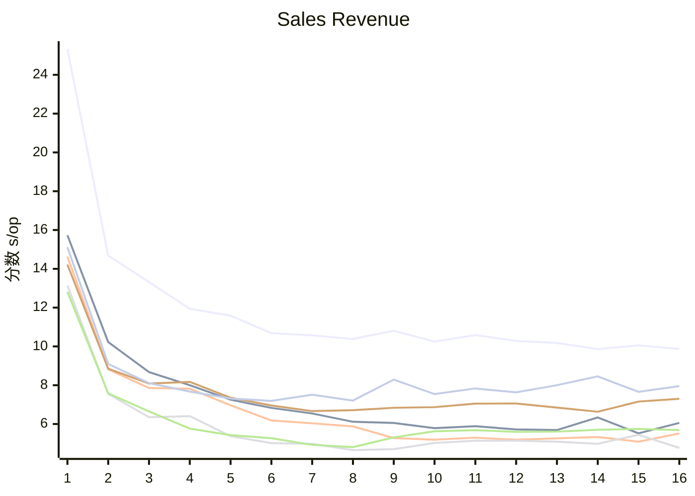
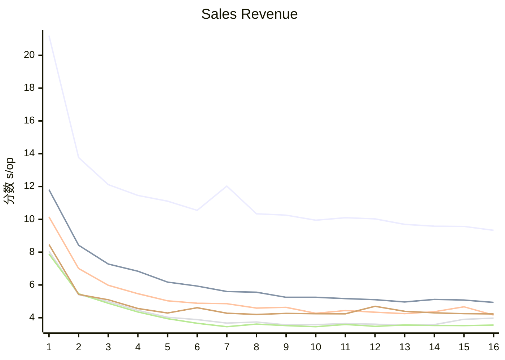

在工作中遇到了一次性大批量向数据库插入数据的需求，调研了网络上的方法，发现都比较片面，在此记录整合测试并记录结果。

<!-- more -->

## 参数

| 参数       | 说明                 |
| ---------- | -------------------- |
| 线程数     | 插入任务工作线程数   |
| 批处理大小 | 每个线程插入多少数据 |
| 事务       | 是否开启自动提交     |
| 插入方式   | 插入使用的 Java 工具 |

## 预设场景

新建如下表：

```sql
CREATE TABLE `excel` (
  `id` int,
  `str` varchar(50),
  `num1` int,
  `num2` decimal(26,6),
  PRIMARY KEY (`id`)
);
```

测试数据量一百万；测试工具采用 JMH，JVM 参数 `-Xmx2048m`，预热一个迭代，测试一个迭代。

## 方案

### 单条自动提交插入

#### 指标

单线程，开启自动提交，一次插入一百万条，耗时 `404.208`。

```
Benchmark                                      (autoCommit)  (chunkSize)  (threadNum)  Mode  Cnt           Score   Error   Units
InsertTest.insertUsingJdbc                             true      1000000            1    ss              404.208            s/op
InsertTest.insertUsingJdbc:gc.alloc.rate               true      1000000            1    ss                4.648          MB/sec
InsertTest.insertUsingJdbc:gc.alloc.rate.norm          true      1000000            1    ss       1970534360.000            B/op
InsertTest.insertUsingJdbc:gc.count                    true      1000000            1    ss               20.000          counts
InsertTest.insertUsingJdbc:gc.time                     true      1000000            1    ss              152.000              ms
```

#### 抓包

| Length | Info                                                                                                                                        |
| ------ | ------------------------------------------------------------------------------------------------------------------------------------------- |
| 168    | Request Query { insert into excel(id,str,num1,num2) values (0,'b7e6bab0-0b70-476e-b0c5-67f63c624ffe',-1155869325,0.10047321632624884) }     |
| 55     | Response OK                                                                                                                                 |
| ...    |                                                                                                                                             |
| 172    | Request Query { insert into excel(id,str,num1,num2) values (999999,'f32153e6-1bb4-4596-8571-9ba95083251e',-108551299,0.18810693725825245) } |
| 55     | Response OK                                                                                                                                 |

#### 分析

TODO

### 单条开启事务插入

#### 指标

在单条自动提交插入的基础上，关闭自动提交，耗时 `142.557` 秒。数据库进程占用单核 100%，JMH 进程占用单核约 70%。

gc 分析，内存未成瓶颈

```
Benchmark                                      (autoCommit)  (chunkSize)  (threadNum)  Mode  Cnt           Score   Error   Units
InsertTest.insertUsingJdbc                            false      1000000            1    ss              142.557            s/op
InsertTest.insertUsingJdbc:gc.alloc.rate              false      1000000            1    ss               13.172          MB/sec
InsertTest.insertUsingJdbc:gc.alloc.rate.norm         false      1000000            1    ss       1970529472.000            B/op
InsertTest.insertUsingJdbc:gc.count                   false      1000000            1    ss               20.000          counts
InsertTest.insertUsingJdbc:gc.time                    false      1000000            1    ss              144.000              ms
```

#### 抓包

| Length | Info                                                                                                                                      |
| ------ | ----------------------------------------------------------------------------------------------------------------------------------------- |
| 67     | Request Query { SET autocommit=0 }                                                                                                        |
| 55     | Response OK                                                                                                                               |
| 168    | Request Query { insert into excel(id,str,num1,num2) values (0,'917500d6-f728-45a2-a9c7-51ccdfe8492f',-1155869325,0.10047321632624884) }   |
| 55     | Response OK                                                                                                                               |
| ...    |                                                                                                                                           |
| 170    | Request Query { insert into excel(id,str,num1,num2) values (999999,'1bc1fec1-196e-4475-b95f-b49debc27a61',448512374,0.7160586140831305) } |
| 55     | Response OK                                                                                                                               |
| 57     | Request Query { commit }                                                                                                                  |
| 55     | Response OK                                                                                                                               |

#### 分析

收到

### 分块插入

#### 指标

在单条开启事务插入的基础上，每一万条执行一次插入并提交，耗时 `141.419` 秒。
数据库进程占用单核 100%，JMH 进程占用单核约 70%。

```
Benchmark                                      (autoCommit)  (chunkSize)  (threadNum)  Mode  Cnt           Score   Error   Units
InsertTest.insertUsingJdbc                            false        10000            1    ss              141.419            s/op
InsertTest.insertUsingJdbc:gc.alloc.rate              false        10000            1    ss               12.769          MB/sec
InsertTest.insertUsingJdbc:gc.alloc.rate.norm         false        10000            1    ss       1894859496.000            B/op
InsertTest.insertUsingJdbc:gc.count                   false        10000            1    ss               12.000          counts
InsertTest.insertUsingJdbc:gc.time                    false        10000            1    ss               28.000              ms
```

#### 抓包

| Length | Info                                                                                                                                     |
| ------ | ---------------------------------------------------------------------------------------------------------------------------------------- |
| 67     | Request Query { SET autocommit=0 }                                                                                                       |
| 55     | Response OK                                                                                                                              |
| 168    | Request Query { insert into excel(id,str,num1,num2) values (0,'cf70b768-cbd0-4120-98b8-e9f7782e1773',-1155869325,0.10047321632624884) }  |
| 55     | Response OK                                                                                                                              |
| ...    |                                                                                                                                          |
| 169    | Request Query { insert into excel(id,str,num1,num2) values (9999,'948f52ac-ab58-489f-a2b9-03b177988bf8',-647914709,0.8473246929075271) } |
| 55     | Response OK                                                                                                                              |
| 57     | Request Query { commit }                                                                                                                 |
| 55     | Response OK                                                                                                                              |

#### 分析

收到

### 多线程插入

#### 指标

在分块插入的基础上，使用两个线程进行插入，耗时 `74.593` 秒。
数据库进程占用双核约 100%，JMH 进程占用双核约 80%

```
Benchmark                                      (autoCommit)  (chunkSize)  (threadNum)  Mode  Cnt           Score   Error   Units
InsertTest.insertUsingJdbc                            false        10000            2    ss               74.593            s/op
InsertTest.insertUsingJdbc:gc.alloc.rate              false        10000            2    ss               25.316          MB/sec
InsertTest.insertUsingJdbc:gc.alloc.rate.norm         false        10000            2    ss       1982983536.000            B/op
InsertTest.insertUsingJdbc:gc.count                   false        10000            2    ss               13.000          counts
InsertTest.insertUsingJdbc:gc.time                    false        10000            2    ss               71.000              ms
```

#### 抓包

| Length | Info                                                                                                                                      |
| ------ | ----------------------------------------------------------------------------------------------------------------------------------------- |
| 67     | Request Query { SET autocommit=0 }                                                                                                        |
| 55     | Response OK                                                                                                                               |
| 169    | Request Query { insert into excel(id,str,num1,num2) values (10000,'0ef84341-0b83-42ba-a2a7-370bd80ba73b',159420602,0.6595096672661478) }  |
| 55     | Response OK                                                                                                                               |
| ...    |                                                                                                                                           |
| 170    | Request Query { insert into excel(id,str,num1,num2) values (19999,'7854ceb9-b4e8-48d2-bcbc-84264eb62c86',121622524,0.02095196101276786) } |
| 55     | Response OK                                                                                                                               |
| 57     | Request Query { commit }                                                                                                                  |
| 55     | Response OK                                                                                                                               |

#### 分析

收到

### 批量插入

#### 指标

在多线程插入的基础上，使用 JDBC 批量方式进行插入，耗时 `7.588` 秒。

```
Benchmark                                           (autoCommit)  (chunkSize)  (threadNum)  Mode  Cnt           Score   Error   Units
InsertTest.insertUsingJdbcBatch                            false        10000            2    ss                7.588            s/op
InsertTest.insertUsingJdbcBatch:gc.alloc.rate              false        10000            2    ss              408.077          MB/sec
InsertTest.insertUsingJdbcBatch:gc.alloc.rate.norm         false        10000            2    ss       3296496864.000            B/op
InsertTest.insertUsingJdbcBatch:gc.count                   false        10000            2    ss               13.000          counts
InsertTest.insertUsingJdbcBatch:gc.time                    false        10000            2    ss              170.000              ms
```

#### 抓包

| Length | Info                                                                                                                                                                                                                            |
| ------ | ------------------------------------------------------------------------------------------------------------------------------------------------------------------------------------------------------------------------------- |
| 67     | Request Query { SET autocommit=0 }                                                                                                                                                                                              |
| 55     | Response OK                                                                                                                                                                                                                     |
| 6168   | 5 Request Query { insert into excel(id,str,num1,num2) values (990000,'bde044cf-7a5e-4276-843f-ea4edcc5767c',-735746651,0.13858670433892972), (990001,'0ee29aa2-5bd8-4d11-b6aa-cb05670956f2',-1905500790,0.6754577365082505)...} |
| 104    | Response OK                                                                                                                                                                                                                     |
| 57     | Request Query { commit }                                                                                                                                                                                                        |
| 55     | Response OK                                                                                                                                                                                                                     |

#### 分析

TODO

### LOAD DATA LOCAL INFILE

`LOAD DATA LOCAL INFILE` 是 `MySQL` 的将文件导入到数据库的方法。

在 Java 中使用 `com.mysql.cj.jdbc.JdbcStatement.setLocalInfileInputStream(InputStream stream)` 设置输入流，执行 SQL

```sql
load data local infile 'noname' into table excel(id,str,num1,num2)
```

即可将流中的内容导入到数据库。

#### 指标

在多线程插入的基础上，使用该方法进行插入，耗时 `5.174` 秒。
数据库进程占

```
Benchmark                                               (autoCommit)  (chunkSize)  (threadNum)  Mode  Cnt           Score   Error   Units
InsertTest.insertUsingMySqlLoadData                            false        10000            2    ss                5.174            s/op
InsertTest.insertUsingMySqlLoadData:gc.alloc.rate              false        10000            2    ss              373.348          MB/sec
InsertTest.insertUsingMySqlLoadData:gc.alloc.rate.norm         false        10000            2    ss       2072046888.000            B/op
InsertTest.insertUsingMySqlLoadData:gc.count                   false        10000            2    ss               10.000          counts
InsertTest.insertUsingMySqlLoadData:gc.time                    false        10000            2    ss               59.000              ms
```

#### 抓包

| Length | Info                                                                                 |
| ------ | ------------------------------------------------------------------------------------ |
| 67     | Request Query { SET autocommit=0 }                                                   |
| 55     | Response OK                                                                          |
| 117    | Request Query { load data local infile 'noname' into table excel(id,str,num1,num2) } |
| 55     | Response LOCAL INFILE                                                                |
| 1166   | 1 Request LOCAL INFILE Payload                                                       |
| 48     | Request                                                                              |
| 113    | Response OK                                                                          |
| 57     | Request Query { commit }                                                             |
| 55     | Response OK                                                                          |

#### 分析

TODO





## 额外优化

### 只读模式检查

在对批量插入方式进行抓包分析时，发现应用每次执行 `insert` 语句前会查询数据库连接是否为只读模式，查询内容为

```log
Length Info
89	Request Query { SELECT @@session.transaction_read_only }
123	Response TABULAR Response  OK
```

分析源码，相关的调用栈为

```log
isReadOnly:1356, ConnectionImpl (com.mysql.cj.jdbc)
isReadOnly:1349, ConnectionImpl (com.mysql.cj.jdbc)
executeBatchInternal:384, ClientPreparedStatement (com.mysql.cj.jdbc)
executeBatch:799, StatementImpl (com.mysql.cj.jdbc)
```

关键函数内容

```java
public boolean isReadOnly(boolean useSessionStatus) throws SQLException {
    // 服务器版本大于 5.6.5，useLocalSessionState 为 false，readOnlyPropagatesToServer 为 true
    if (useSessionStatus && !this.session.isClosed() && versionMeetsMinimum(5, 6, 5)
            && !this.useLocalSessionState.getValue() && this.readOnlyPropagatesToServer.getValue()) {
        // 服务器版本大于等于 8.0.3 或 [5.7.20, 8.0.0) 使用变量 "@@session.transaction_read_only"
        String s = this.session.queryServerVariable(
                versionMeetsMinimum(8, 0, 3) || versionMeetsMinimum(5, 7, 20) && !versionMeetsMinimum(8, 0, 0)
                        ? "@@session.transaction_read_only"
                        : "@@session.tx_read_only");
        if (s != null) {
            // 非 0 为真
            return Integer.parseInt(s) != 0;
        }
    }
    return this.readOnly;
}
```

MySQL JDBC Driver 执行 `executeBatch` 时每次会检查连接是否只读模式，如果是只读模式会抛出异常。
当服务器版本大于 `5.6.5`，`useLocalSessionState` 为 `false`，`readOnlyPropagatesToServer` 为 `true` 时，驱动会向服务器发送查询请求。属性说明如下

| 属性                       | 默认  | 说明                                                                          |
| -------------------------- | ----- | ----------------------------------------------------------------------------- |
| useLocalSessionState       | false | 驱动程序是否使用内部维护的自动提交和事务隔离值                                |
| readOnlyPropagatesToServer | true  | 调用  Connection.setReadOnly() 时是否设置服务器事务模式，开启 InnoDB 只读优化 |

解决方案是 `useLocalSessionState` 设置为 `true` 避免多余的查询。
