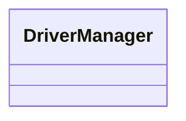
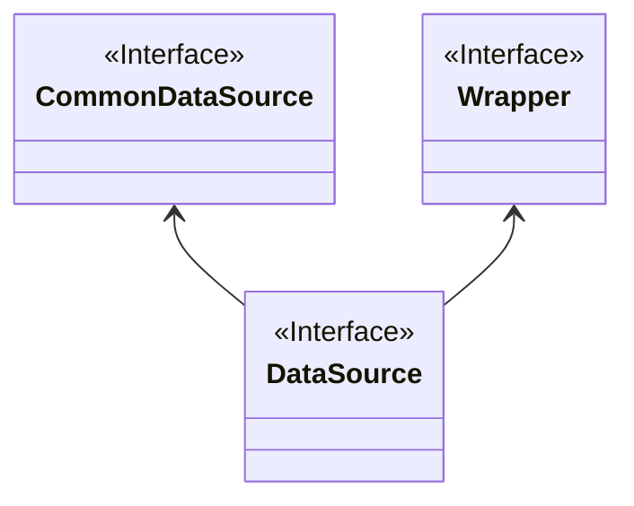
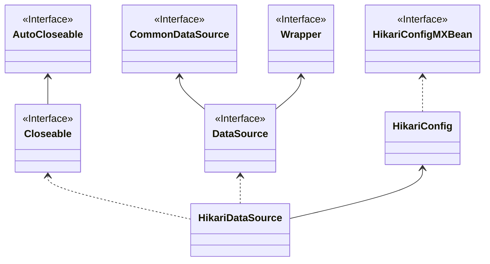
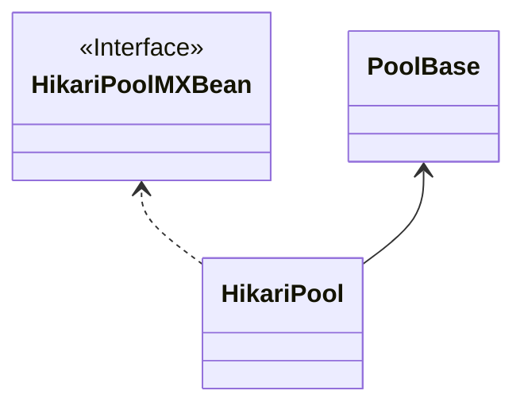

最近在做一些数据库相关的工作，在此系统性地整理 JDBC 相关知识。

JDBC（Java Database Connectivity）直译为 Java 数据库连接。JDBC 是一个 Java API，用于 Java 连接并执行数据库查询。JDBC 与数据库驱动程序一起使用就可以访问数据库。

<!-- more -->

## 定义

JDBC 是 Java 编程中用于与数据库交互的 API（应用程序编程接口）。JDBC 的类和接口允许应用程序将用户发出的请求发送到指定的数据库。JDBC 的当前版本是 JDBC 4.3，发布于 2017 年 9 月 21 日。

## DriverManager



### 作用

作用如类名，管理数据库的驱动类，需要将驱动实例化后注册到其中，然后连接数据库的时候会尝试用驱动取连接。

### 方法

其公共方法有三类，分别是获取连接、管理查询驱动、设置超时时间，除了获取连接有些相关性不大，其他方法确实称得上是驱动管理器

| 方法                                                               | 作用                  |
| ------------------------------------------------------------------ | --------------------- |
| Connection getConnection(String url, java.util.Properties info)    | 获取连接              |
| Connection getConnection(String url, String user, String password) | 获取连接              |
| Connection getConnection(String url)                               | 获取连接              |
| void registerDriver(java.sql.Driver driver)                        | 注册驱动              |
| void registerDriver(java.sql.Driver driver, DriverAction da)       | 注册驱动              |
| void deregisterDriver(Driver driver)                               | 注销驱动              |
| Driver getDriver(String url)                                       | 获取能处理 url 的驱动 |
| Enumeration\<Driver> getDrivers()                                  | 获取所有驱动          |
| Stream\<Driver> drivers()                                          | 获取所有驱动          |
| void setLoginTimeout(int seconds)                                  | 设置连接超时时间      |
| int getLoginTimeout()                                              | 获取连接超时时间      |

### 源码

这个类比自 Java 1.1 起就存在，代码风格比较旧

```java
/**
 * 管理 JDBC 驱动，更推荐用 DataSource 连接数据库
 * 初始化时会从 jdbc.drivers 系统属性读取类名，然后用 ClassLoader加载。另一种方式是用 ServiceLoader 方式加载
 */
public class DriverManager {
    // 注册的驱动，只保存手动注册的驱动
    private static final CopyOnWriteArrayList<DriverInfo> registeredDrivers = new CopyOnWriteArrayList<>();
    private static volatile int loginTimeout = 0;
    // 驱动初始化同步锁
    private static final Object lockForInitDrivers = new Object();
    // 驱动是否已初始化
    private static volatile boolean driversInitialized;
    // 系统参数
    private static final String JDBC_DRIVERS_PROPERTY = "jdbc.drivers";

    // 工具类防止实例化
    private DriverManager() {
    }

    /**
     * 建立连接，如果 url 和 properties 中的参数相同，最后生效的参数依赖于驱动的实现
     *
     * @param url  数据库 url，形式为 jdbc:subprotocol:subname
     * @param info 连接参数，至少要有 user、password
     * @return 连接
     */
    @CallerSensitive
    public static Connection getConnection(String url, java.util.Properties info) throws SQLException {
        return (getConnection(url, info, Reflection.getCallerClass()));
    }

    /**
     * 建立连接
     *
     * @param url      数据库 url，形式为 jdbc:subprotocol:subname
     * @param user     用户名
     * @param password 密码
     * @return 连接
     */
    @CallerSensitive
    public static Connection getConnection(String url,
            String user, String password) throws SQLException {
        java.util.Properties info = new java.util.Properties();
        if (user != null) {
            info.put("user", user);
        }
        if (password != null) {
            info.put("password", password);
        }
        return (getConnection(url, info, Reflection.getCallerClass()));
    }

    /**
     * 建立连接，参数为空
     *
     * @param url 数据库 url，形式为 jdbc:subprotocol:subname
     * @return 连接
     */
    @CallerSensitive
    public static Connection getConnection(String url) throws SQLException {
        java.util.Properties info = new java.util.Properties();
        return (getConnection(url, info, Reflection.getCallerClass()));
    }

    /**
     * 真正的获取连接方法，叫 doGetConnection 更合适
     *
     * @param url    数据库 url
     * @param info   连接参数
     * @param caller 调用该方法的类
     * @return 连接
     */
    @CallerSensitiveAdapter
    private static Connection getConnection(String url, java.util.Properties info, Class<?> caller)
            throws SQLException {
        // 获取 ClassLoader，用来加载外部类
        ClassLoader callerCL = caller != null ? caller.getClassLoader() : null;
        if (callerCL == null || callerCL == ClassLoader.getPlatformClassLoader()) {
            callerCL = Thread.currentThread().getContextClassLoader();
        }
        ensureDriversInitialized();
        SQLException reason = null;
        // 此处为何不用 getDriver ？
        for (DriverInfo aDriver : registeredDrivers) {
            // 调用者是否有权限加载驱动
            if (isDriverAllowed(aDriver.driver, callerCL)) {
                try {
                    // 连接数据库
                    Connection con = aDriver.driver.connect(url, info);
                    if (con != null) {
                        return (con);
                    }
                } catch (SQLException ex) {
                    if (reason == null) {
                        reason = ex;
                    }
                }
            }
        }
        // 连接失败
        if (reason != null) {
            throw reason;
        }
        // 没有合适的驱动
        throw new SQLException("No suitable driver found for " + url, "08001");
    }

    /**
     * 获取能理解 url 的第一个驱动
     *
     * @param url 数据库地址
     * @return 驱动
     */
    @CallerSensitive
    public static Driver getDriver(String url) throws SQLException {
        ensureDriversInitialized();
        Class<?> callerClass = Reflection.getCallerClass();
        for (DriverInfo aDriver : registeredDrivers) {
            // 获取有权限驱动
            if (isDriverAllowed(aDriver.driver, callerClass)) {
                try {
                    // 驱动是否能处理 url
                    if (aDriver.driver.acceptsURL(url)) {
                        return (aDriver.driver);
                    }
                } catch (SQLException sqe) {
                    // 跳过当前驱动
                }
            } else {
                println("skipping: " + aDriver.driver.getClass().getName());
            }
        }
        throw new SQLException("No suitable driver", "08001");
    }

    /**
     * 获取所有驱动
     *
     * @return 驱动列表
     */
    @CallerSensitive
    public static Enumeration<Driver> getDrivers() {
        ensureDriversInitialized();
        return Collections.enumeration(getDrivers(Reflection.getCallerClass()));
    }

    /**
     * 获取所有驱动
     *
     * @return 驱动流
     */
    @CallerSensitive
    public static Stream<Driver> drivers() {
        ensureDriversInitialized();
        return getDrivers(Reflection.getCallerClass()).stream();
    }

    /**
     * 获取所有驱动
     *
     * @param callerClass 调用类
     * @return 驱动列表
     */
    private static List<Driver> getDrivers(Class<?> callerClass) {
        List<Driver> result = new ArrayList<>();
        for (DriverInfo aDriver : registeredDrivers) {
            // 获取有权限的驱动
            if (isDriverAllowed(aDriver.driver, callerClass)) {
                result.add(aDriver.driver);
            } else {
                println("skipping: " + aDriver.driver.getClass().getName());
            }
        }
        return result;
    }

    /**
     * 注册驱动
     *
     * @param driver 驱动
     */
    public static void registerDriver(java.sql.Driver driver) throws SQLException {
        registerDriver(driver, null);
    }

    /**
     * 注册驱动
     *
     * @param driver 驱动
     * @param da     注销驱动时的行为
     */
    public static void registerDriver(java.sql.Driver driver, DriverAction da) throws SQLException {
        if (driver != null) {
            // 注册不存在的驱动
            registeredDrivers.addIfAbsent(new DriverInfo(driver, da));
        } else {
            throw new NullPointerException();
        }
    }

    /**
     * 注销驱动
     *
     * @param driver 驱动
     */
    @CallerSensitive
    public static void deregisterDriver(Driver driver) throws SQLException {
        if (driver == null) {
            return;
        }
        DriverInfo aDriver = new DriverInfo(driver, null);
        synchronized (lockForInitDrivers) {
            if (registeredDrivers.contains(aDriver)) {
                if (isDriverAllowed(driver, Reflection.getCallerClass())) {
                    DriverInfo di = registeredDrivers.get(registeredDrivers.indexOf(aDriver));
                    // 执行注销动作
                    if (di.action() != null) {
                        di.action().deregister();
                    }
                    registeredDrivers.remove(aDriver);
                } else {
                    throw new SecurityException();
                }
            } else {
                println("couldn't find driver to unload");
            }
        }
    }

    /**
     * 设置连接超时时间
     *
     * @param seconds 0 为无限制
     */
    public static void setLoginTimeout(int seconds) {
        loginTimeout = seconds;
    }

    /**
     * 获取连接超时时间
     *
     * @return 秒
     */
    public static int getLoginTimeout() {
        return (loginTimeout);
    }

    /**
     * 尝试加载驱动
     *
     * @param driver 驱动类
     * @param caller 调用类
     * @return 加载是否成功
     */
    private static boolean isDriverAllowed(Driver driver, Class<?> caller) {
        ClassLoader callerCL = caller != null ? caller.getClassLoader() : null;
        return isDriverAllowed(driver, callerCL);
    }

    /**
     * 尝试加载驱动
     *
     * @param driver 驱动类
     * @param caller 调用类
     * @return 加载是否成功
     */
    private static boolean isDriverAllowed(Driver driver, ClassLoader classLoader) {
        boolean result = false;
        if (driver != null) {
            Class<?> aClass = null;
            try {
                aClass = Class.forName(driver.getClass().getName(), true, classLoader);
            } catch (Exception ex) {
                result = false;
            }
            result = (aClass == driver.getClass()) ? true : false;
        }
        return result;
    }

    /**
     * 初始化驱动类，两种方式：ServiceLoader、ClassLoader
     */
    private static void ensureDriversInitialized() {
        if (driversInitialized) {
            return;
        }
        // 双重检查锁，为什么还在用 synchronized？
        synchronized (lockForInitDrivers) {
            if (driversInitialized) {
                return;
            }
            // 利用 SPI 获取 Driver 实现类
            ServiceLoader<Driver> loadedDrivers = ServiceLoader.load(Driver.class);
            Iterator<Driver> driversIterator = loadedDrivers.iterator();
            // 取出类，使驱动的静态代码块运行 DriverManager.registerDriver 方法将自己实例化，注册到 DriverManager
            try {
                while (driversIterator.hasNext()) {
                    driversIterator.next();
                }
            } catch (Throwable t) {
                // 忽略错误
            }
            // 加载 jdbc.drivers 系统属性
            String drivers = System.getProperty(JDBC_DRIVERS_PROPERTY);
            // 加载驱动
            if (drivers != null && !drivers.isEmpty()) {
                String[] driversList = drivers.split(":");
                for (String aDriver : driversList) {
                    try {
                        Class.forName(aDriver, true, ClassLoader.getSystemClassLoader());
                    } catch (Exception ex) {
                        println("DriverManager.Initialize: load failed: " + ex);
                    }
                }
            }
            driversInitialized = true;
        }
    }
}
```

### 知识点

#### 为什么使用驱动前需要 `Class.forName("com.mysql.jdbc.Driver")`

当年初学 Java，连接数据库第一步是 `Class.forName("com.mysql.jdbc.Driver")`。这是为什么呢？

通过`DriverManager`的源代码，可以看出想要使用`DriverManager`连接数据库，要先把驱动注册到`DriverManager`。

`Class.forName("com.mysql.jdbc.Driver")`将该驱动类加载到 JVM 中，该类的静态代码块中有这么一句：

```java
DriverManager.registerDriver(new Driver());
```

类似的，ClickHouse 驱动的静态代码块中有这么一句：

```java
DriverManager.registerDriver(new ClickHouseDriver());
```

Java 在 1.6 之后添加了 SPI 机制，而 MySQL 的驱动在 5.1.6 版本后，jar 包中添加了`META-INF/services/java.sql.Driver`文件，文件内容为`com.mysql.jdbc.Driver`。只要满足 JDK 版本大于等于 1.6，驱动添加了 SPI 文件，`DriverManager.ensureDriversInitialized()`在运行的时候就会将驱动注册到`DriverManager`中。

## DataSource



### 作用

### 方法

| 方法                                                       | 作用                                      |
| ---------------------------------------------------------- | ----------------------------------------- |
| Connection getConnection()                                 | 获取连接                                  |
| Connection getConnection(String username, String password) | 通过用户密码获取连接                      |
| void setLoginTimeout(int seconds)                          | 设置登录超时时间                          |
| int getLoginTimeout()                                      | 获取登录超时时间                          |
| ConnectionBuilder createConnectionBuilder()                | 创建一个 ConnectionBuilder 实例，用来分表 |
| ShardingKeyBuilder createShardingKeyBuilder()              | 继承自 CommonDataSource，用来分表         |
| \<T> T unwrap(java.lang.Class\<T> iface)                   | 继承自 Wrapper，解包装成指定类            |
| boolean isWrapperFor(java.lang.Class\<?> iface)            | 继承自 Wrapper，是否是指定类的包装        |

### 源码

```java
public interface DataSource extends CommonDataSource, Wrapper {
    /**
     * 获取连接
     *
     * @return 连接
     */
    Connection getConnection() throws SQLException;

    /**
     * 获取连接
     *
     * @param username 用户名
     * @param password 密码
     * @return 连接
     */
    Connection getConnection(String username, String password) throws SQLException;

    /**
     * 设置登录超时时间
     */
    @Override
    void setLoginTimeout(int seconds) throws SQLException;

    /**
     * 获取登录超时时间
     */
    @Override
    int getLoginTimeout() throws SQLException;

    /**
     * 创建一个 ConnectionBuilder 实例
     * 使用 sharding 时要使用该方法
     *
     * @return ConnectionBuilder 实例
     */
    default ConnectionBuilder createConnectionBuilder() throws SQLException {
        throw new SQLFeatureNotSupportedException("createConnectionBuilder not implemented");
    }
}
```

### 实现类

#### HikariDataSource



##### 作用

知名的数据库连接池 HikariCP 的实现类，利用 HikariPool 对连接进行缓存。

##### 方法

除 DataSource 的方法外，还实现了以下方法

| 方法                                                                       | 作用               |
| -------------------------------------------------------------------------- | ------------------ |
| void setMetricRegistry(Object metricRegistry)                              | 设置度量注册表     |
| void setMetricsTrackerFactory(MetricsTrackerFactory metricsTrackerFactory) | 设置度量追踪工厂   |
| void setHealthCheckRegistry(Object healthCheckRegistry)                    | 设置健康检查注册表 |
| boolean isRunning()                                                        | 连接池是否正在运行 |
| void evictConnection(Connection connection)                                | 从连接池逐出连接   |
| void close()                                                               | 关闭 DataSource    |
| boolean isClosed()                                                         | 是否被关闭         |

##### 源码

```java
/**
 * HikariCP DataSource.
 */
public class HikariDataSource extends HikariConfig implements DataSource, Closeable {
    // 关闭标志
    private final AtomicBoolean isShutdown = new AtomicBoolean();
    // 优先使用的连接池
    private final HikariPool fastPathPool;
    // 懒加载连接池
    private volatile HikariPool pool;

    /**
     * 默认构造器，默认配置，连接池懒加载
     */
    public HikariDataSource() {
        super();
        fastPathPool = null;
    }

    /**
     * 使用指定配置构造器，连接池直接实例化
     *
     * @param configuration 配置
     */
    public HikariDataSource(HikariConfig configuration) {
        // 检查并复制配置
        configuration.validate();
        configuration.copyStateTo(this);
        // 实例化连接池
        pool = fastPathPool = new HikariPool(this);
        // 密封配置，不允许修改
        this.seal();
    }

    @Override
    public Connection getConnection() throws SQLException {
        // 关闭了不能再使用
        if (isClosed()) {
            throw new SQLException("HikariDataSource " + this + " has been closed.");
        }
        // 不需要懒加载连接池
        if (fastPathPool != null) {
            return fastPathPool.getConnection();
        }
        // 双重检查锁
        HikariPool result = pool;
        if (result == null) {
            synchronized (this) {
                result = pool;
                if (result == null) {
                    validate();
                    try {
                        // 创建连接池
                        pool = result = new HikariPool(this);
                        // 密封配置，不允许修改
                        this.seal();
                    } catch (PoolInitializationException pie) {
                        throw pie;
                    }
                }
            }
        }
        // 获取连接
        return result.getConnection();
    }

    /**
     * 通过用户密码获取连接，不支持
     */
    @Override
    public Connection getConnection(String username, String password) throws SQLException {
        throw new SQLFeatureNotSupportedException();
    }

    /**
     * 获取指定类型未包装的 DataSource
     */
    @Override
    @SuppressWarnings("unchecked")
    public <T> T unwrap(Class<T> iface) throws SQLException {
        // 当前实例是指定类型
        if (iface.isInstance(this)) {
            return (T) this;
        }
        HikariPool p = pool;
        if (p != null) {
            // 连接池中的 DataSource
            final DataSource unwrappedDataSource = p.getUnwrappedDataSource();
            if (iface.isInstance(unwrappedDataSource)) {
                return (T) unwrappedDataSource;
            }

            if (unwrappedDataSource != null) {
                // 再解包装一次
                return unwrappedDataSource.unwrap(iface);
            }
        }
        throw new SQLException("Wrapped DataSource is not an instance of " + iface);
    }

    /**
     * 判断是否是指定类型包装后的 DataSource
     */
    @Override
    public boolean isWrapperFor(Class<?> iface) throws SQLException {
        // 同 unwrap
        if (iface.isInstance(this)) {
            return true;
        }
        HikariPool p = pool;
        if (p != null) {
            final DataSource unwrappedDataSource = p.getUnwrappedDataSource();
            if (iface.isInstance(unwrappedDataSource)) {
                return true;
            }

            if (unwrappedDataSource != null) {
                return unwrappedDataSource.isWrapperFor(iface);
            }
        }
        return false;
    }

    /**
     * 设置度量注册表
     */
    @Override
    public void setMetricRegistry(Object metricRegistry) {
        boolean isAlreadySet = getMetricRegistry() != null;
        // 设置配置的度量注册表
        super.setMetricRegistry(metricRegistry);

        HikariPool p = pool;
        if (p != null) {
            if (isAlreadySet) {
                // 不能重复设置
                throw new IllegalStateException("MetricRegistry can only be set one time");
            } else {
                // 设置连接池的度量注册表
                p.setMetricRegistry(super.getMetricRegistry());
            }
        }
    }

    /**
     * 设置度量追踪工厂
     */
    @Override
    public void setMetricsTrackerFactory(MetricsTrackerFactory metricsTrackerFactory) {
        boolean isAlreadySet = getMetricsTrackerFactory() != null;
        // 设置配置的度量追踪工厂
        super.setMetricsTrackerFactory(metricsTrackerFactory);

        HikariPool p = pool;
        if (p != null) {
            if (isAlreadySet) {
                // 不能重复设置
                throw new IllegalStateException("MetricsTrackerFactory can only be set one time");
            } else {
                // 设置连接池的度量追踪工厂
                p.setMetricsTrackerFactory(super.getMetricsTrackerFactory());
            }
        }
    }

    /**
     * 设置健康检查注册表
     */
    @Override
    public void setHealthCheckRegistry(Object healthCheckRegistry) {
        boolean isAlreadySet = getHealthCheckRegistry() != null;
        // 设置配置的健康检查注册表
        super.setHealthCheckRegistry(healthCheckRegistry);

        HikariPool p = pool;
        if (p != null) {
            if (isAlreadySet) {
                // 不能重复设置
                throw new IllegalStateException("HealthCheckRegistry can only be set one time");
            } else {
                // 设置连接池的健康检查注册表
                p.setHealthCheckRegistry(super.getHealthCheckRegistry());
            }
        }
    }

    /**
     * 连接池是否正在运行
     *
     * @return 是否
     */
    public boolean isRunning() {
        return pool != null && pool.poolState == POOL_NORMAL;
    }

    /**
     * 从连接池逐出连接。如果连接正在使用，将来会被逐出。如果连接在等待状态，立刻关闭并逐出。
     *
     * @param connection 连接
     */
    public void evictConnection(Connection connection) {
        HikariPool p;
        if (!isClosed() && (p = pool) != null && connection.getClass().getName().startsWith("com.zaxxer.hikari")) {
            p.evictConnection(connection);
        }
    }

    /**
     * 关闭 DataSource
     */
    @Override
    public void close() {
        // 防止多线程同时关闭
        if (isShutdown.getAndSet(true)) {
            return;
        }
        // 关闭连接池
        HikariPool p = pool;
        if (p != null) {
            try {
                p.shutdown();
            } catch (InterruptedException e) {
                Thread.currentThread().interrupt();
            }
        }
    }

    /**
     * HikariDataSource 是否被关闭
     *
     * @return 是否
     */
    public boolean isClosed() {
        return isShutdown.get();
    }
}
```

#### HikariPool



##### 源码

```java

```
