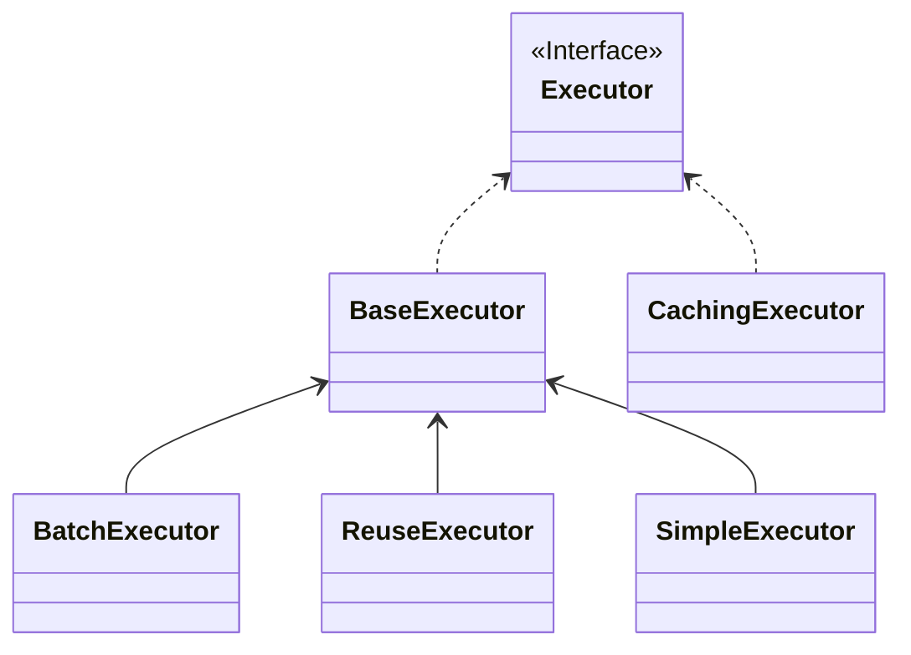
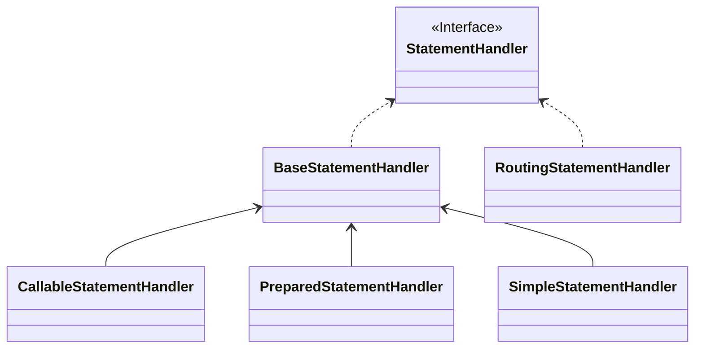

`executor` 模块位于`org.apache.ibatis.executor`包下，此模块的提供了用户使用 Mybatis 的主要接口和配置类。主要的类和接口有

- Executor
- StatementHandler

<!-- more -->

## Executor



### 作用

`SqlSession`通过`Executor`操作数据库，`DefaultSqlSession`使用`Executor`的方式有以下几种

```java
MappedStatement ms = configuration.getMappedStatement(statement);
// 查询修改数据
Cursor<T> cursor = executor.queryCursor(ms, wrapCollection(parameter), rowBounds);
List<E> list = executor.query(ms, wrapCollection(parameter), rowBounds, handler);
int rows = executor.update(ms, wrapCollection(parameter));
// 操作事务和批量
executor.commit(isCommitOrRollbackRequired(force));
executor.rollback(isCommitOrRollbackRequired(force));
List<BatchResult> results = executor.flushStatements();
// 关闭会话
executor.close(isCommitOrRollbackRequired(false));
// 获取连接
Connection connection = executor.getTransaction().getConnection();
// 清除会话缓存
executor.clearLocalCache();
```

### 方法

`SqlSessionFactoryBuilder` 的方法有如下三类

- 从字符流创建`SqlSessionFactory`

| 方法                                                            |
| --------------------------------------------------------------- |
| build(Reader reader)                                            |
| build(Reader reader, String environment)                        |
| build(Reader reader, Properties properties)                     |
| build(Reader reader, String environment, Properties properties) |

最终通过`build(Reader reader, String environment, Properties properties)`解析`XML`，调用`build(Configuration config)`。

- 从字节流创建`SqlSessionFactory`

| 方法                                                                      |
| ------------------------------------------------------------------------- |
| build(InputStream inputStream)                                            |
| build(InputStream inputStream, String environment)                        |
| build(InputStream inputStream, Properties properties)                     |
| build(InputStream inputStream, String environment, Properties properties) |

最终通过`build(InputStream inputStream, String environment, Properties properties)`解析`XML`，调用`build(Configuration config)`。

- 通过 `Configuration` 创建 `SqlSessionFactory`

| 方法                        |
| --------------------------- |
| build(Configuration config) |

### 源码

```java
/**
 * 执行 MappedStatement 的执行器
 */
public interface Executor {

    /**
     * 修改数据库
     *
     * @param ms
     * @param parameter
     * @return
     * @throws SQLException
     */
    int update(MappedStatement ms, Object parameter) throws SQLException;

    /**
     * 查询，
     *
     * @param <E>
     * @param ms
     * @param parameter
     * @param rowBounds
     * @param resultHandler
     * @param cacheKey
     * @param boundSql
     * @return
     * @throws SQLException
     */
    <E> List<E> query(MappedStatement ms, Object parameter, RowBounds rowBounds, ResultHandler resultHandler,
            CacheKey cacheKey, BoundSql boundSql) throws SQLException;

    <E> List<E> query(MappedStatement ms, Object parameter, RowBounds rowBounds, ResultHandler resultHandler)
            throws SQLException;

    <E> Cursor<E> queryCursor(MappedStatement ms, Object parameter, RowBounds rowBounds) throws SQLException;

    /**
     *
     * @param ms
     * @param parameterObject
     * @param rowBounds
     * @param boundSql
     * @return
     */
    CacheKey createCacheKey(MappedStatement ms, Object parameterObject, RowBounds rowBounds, BoundSql boundSql);

    /**
     *
     * @param ms
     * @param key
     * @return
     */
    boolean isCached(MappedStatement ms, CacheKey key);

    /**
     *
     * @param ms
     * @param resultObject
     * @param property
     * @param key
     * @param targetType
     */
    void deferLoad(MappedStatement ms, MetaObject resultObject, String property, CacheKey key, Class<?> targetType);

    /**
     * 是否关闭
     *
     * @return 是否关闭
     */
    boolean isClosed();

    /**
     *
     * @param executor
     */
    void setExecutorWrapper(Executor executor);

    List<BatchResult> flushStatements() throws SQLException;

    void commit(boolean required) throws SQLException;

    void rollback(boolean required) throws SQLException;

    void clearLocalCache();

    void close(boolean forceRollback);

    Transaction getTransaction();
}
```

### 实现类

#### SimpleExecutor

##### 作用

准备`Statement`，调用`StatementHandler`执行数据库操作，执行完毕关闭`Statement`。

##### 方法

`SimpleExecutor` 实现了`BaseExecutor`的四个抽象方法，在其中获取可执行的 `Statement`，然后调用`StatementHandler`执行数据库操作。

| 方法                                                                                                               |
| ------------------------------------------------------------------------------------------------------------------ |
| doUpdate(MappedStatement ms, Object parameter)                                                                     |
| doQuery(MappedStatement ms, Object parameter, RowBounds rowBounds, ResultHandler resultHandler, BoundSql boundSql) |
| doQueryCursor(MappedStatement ms, Object parameter, RowBounds rowBounds, BoundSql boundSql)                        |
| doFlushStatements(boolean isRollback)                                                                              |

<mark>SimpleExecutor 不支持批量操作，doFlushStatements 返回空列表</mark>

| 方法                                                         | 作用                           |
| ------------------------------------------------------------ | ------------------------------ |
| prepareStatement(StatementHandler handler, Log statementLog) | 通过 Connection 创建 Statement |

##### 源码

```java
/**
 * 默认的执行器，使用完 Statement 立刻关闭
 */
public class SimpleExecutor extends BaseExecutor {

    public SimpleExecutor(Configuration configuration, Transaction transaction) {
        super(configuration, transaction);
    }

    @Override
    public int doUpdate(MappedStatement ms, Object parameter) throws SQLException {
        Statement stmt = null;
        try {
            Configuration configuration = ms.getConfiguration();
            // 获取 StatementHandler
            StatementHandler handler = configuration.newStatementHandler(this, ms, parameter, RowBounds.DEFAULT, null,
                    null);
            // 获取可执行的 Statement
            stmt = prepareStatement(handler, ms.getStatementLog());
            // 执行更新
            return handler.update(stmt);
        } finally {
            // 关闭 Statement
            closeStatement(stmt);
        }
    }

    @Override
    public <E> List<E> doQuery(MappedStatement ms, Object parameter, RowBounds rowBounds, ResultHandler resultHandler,
            BoundSql boundSql) throws SQLException {
        Statement stmt = null;
        try {
            Configuration configuration = ms.getConfiguration();
            // 获取 StatementHandler
            StatementHandler handler = configuration.newStatementHandler(wrapper, ms, parameter, rowBounds,
                    resultHandler,
                    boundSql);
            // 获取可执行的 Statement
            stmt = prepareStatement(handler, ms.getStatementLog());
            // 执行查询列表
            return handler.query(stmt, resultHandler);
        } finally {
            // 关闭 Statement
            closeStatement(stmt);
        }
    }

    @Override
    protected <E> Cursor<E> doQueryCursor(MappedStatement ms, Object parameter, RowBounds rowBounds, BoundSql boundSql)
            throws SQLException {
        Configuration configuration = ms.getConfiguration();
        // 获取 StatementHandler
        StatementHandler handler = configuration.newStatementHandler(wrapper, ms, parameter, rowBounds, null, boundSql);
        // 获取可执行的 Statement
        Statement stmt = prepareStatement(handler, ms.getStatementLog());
        // 执行查询游标
        Cursor<E> cursor = handler.queryCursor(stmt);
        // 读取完成关闭 Statement
        stmt.closeOnCompletion();
        return cursor;
    }

    /**
     * 不是批量，什么也不做
     */
    @Override
    public List<BatchResult> doFlushStatements(boolean isRollback) {
        return Collections.emptyList();
    }

    /**
     * 获取可执行的 Statement
     *
     * @param handler      StatementHandler
     * @param statementLog 用于记录 Statement 日志
     * @return
     * @throws SQLException
     */
    private Statement prepareStatement(StatementHandler handler, Log statementLog) throws SQLException {
        Statement stmt;
        // 获取 Connection
        Connection connection = getConnection(statementLog);
        // 创建并设置 Statement
        stmt = handler.prepare(connection, transaction.getTimeout());
        // 设置 SQL 参数
        handler.parameterize(stmt);
        return stmt;
    }
}
```

#### ReuseExecutor

##### 作用

准备`Statement`，调用`StatementHandler`执行数据库操作，缓存`Statement`。

##### 方法

`ReuseExecutor` 实现了`BaseExecutor`的四个抽象方法，在其中获取可执行的 `Statement`，然后调用`StatementHandler`执行数据库操作。

| 方法                                                                                                                        |
| --------------------------------------------------------------------------------------------------------------------------- |
| int doUpdate(MappedStatement ms, Object parameter)                                                                          |
| List\<E> doQuery(MappedStatement ms, Object parameter, RowBounds rowBounds, ResultHandler resultHandler, BoundSql boundSql) |
| Cursor\<E> doQueryCursor(MappedStatement ms, Object parameter, RowBounds rowBounds, BoundSql boundSql)                      |
| List\<BatchResult> doFlushStatements(boolean isRollback)                                                                    |

<mark>SimpleExecutor 不支持批量操作，doFlushStatements 返回空列表</mark>

| 方法                                                                   | 作用                           |
| ---------------------------------------------------------------------- | ------------------------------ |
| Statement prepareStatement(StatementHandler handler, Log statementLog) | 通过 Connection 创建 Statement |
| boolean hasStatementFor(String sql)                                    |                                |
| Statement getStatement(String s)                                       |                                |
| void putStatement(String sql, Statement stmt)                          |                                |

##### 源码

```java
/**
 * 复用执行器，缓存 Statement，用 SQL 判断是否相同的 Statement
 */
public class ReuseExecutor extends BaseExecutor {
    // Statement 缓存，key 为 SQL
    private final Map<String, Statement> statementMap = new HashMap<>();

    public ReuseExecutor(Configuration configuration, Transaction transaction) {
        super(configuration, transaction);
    }

    @Override
    public int doUpdate(MappedStatement ms, Object parameter) throws SQLException {
        Configuration configuration = ms.getConfiguration();
        // 获取 StatementHandler
        StatementHandler handler = configuration.newStatementHandler(this, ms, parameter, RowBounds.DEFAULT, null,
                null);
        // 获取可执行的 Statement
        Statement stmt = prepareStatement(handler, ms.getStatementLog());
        // 执行更新
        return handler.update(stmt);
    }

    @Override
    public <E> List<E> doQuery(MappedStatement ms, Object parameter, RowBounds rowBounds, ResultHandler resultHandler,
            BoundSql boundSql) throws SQLException {
        Configuration configuration = ms.getConfiguration();
        // 获取 StatementHandler
        StatementHandler handler = configuration.newStatementHandler(wrapper, ms, parameter, rowBounds, resultHandler,
                boundSql);
        // 获取可执行的 Statement
        Statement stmt = prepareStatement(handler, ms.getStatementLog());
        // 执行查询列表
        return handler.query(stmt, resultHandler);
    }

    @Override
    protected <E> Cursor<E> doQueryCursor(MappedStatement ms, Object parameter, RowBounds rowBounds, BoundSql boundSql)
            throws SQLException {
        Configuration configuration = ms.getConfiguration();
        // 获取 StatementHandler
        StatementHandler handler = configuration.newStatementHandler(wrapper, ms, parameter, rowBounds, null, boundSql);
        // 获取可执行的 Statement
        Statement stmt = prepareStatement(handler, ms.getStatementLog());
        // 执行查询游标
        return handler.queryCursor(stmt);
    }

    /**
     * 关闭并清空缓存的 Statement
     *
     * @param isRollback 是否回滚，无用
     * @return 空列表
     */
    @Override
    public List<BatchResult> doFlushStatements(boolean isRollback) {
        for (Statement stmt : statementMap.values()) {
            closeStatement(stmt);
        }
        statementMap.clear();
        return Collections.emptyList();
    }

    /**
     * 获取可执行的 Statement
     *
     * @param handler      StatementHandler
     * @param statementLog 用于记录 Statement 日志
     * @return Statement
     * @throws SQLException
     */
    private Statement prepareStatement(StatementHandler handler, Log statementLog) throws SQLException {
        Statement stmt;
        BoundSql boundSql = handler.getBoundSql();
        String sql = boundSql.getSql();
        // 缓存 Statement
        if (hasStatementFor(sql)) {
            stmt = getStatement(sql);
            // 为什么要再次设置超时时间？
            applyTransactionTimeout(stmt);
        } else {
            Connection connection = getConnection(statementLog);
            // 创建并设置 Statement
            stmt = handler.prepare(connection, transaction.getTimeout());
            putStatement(sql, stmt);
        }
        // 设置 SQL 参数
        handler.parameterize(stmt);
        return stmt;
    }

    /**
     * 是否有 Statement 缓存
     *
     * @param sql SQL
     * @return 缓存中有 Statement 且 Connection 未关闭返回真
     */
    private boolean hasStatementFor(String sql) {
        try {
            Statement statement = statementMap.get(sql);
            return statement != null && !statement.getConnection().isClosed();
        } catch (SQLException e) {
            return false;
        }
    }

    private Statement getStatement(String s) {
        return statementMap.get(s);
    }

    private void putStatement(String sql, Statement stmt) {
        statementMap.put(sql, stmt);
    }
}
```

#### BatchExecutor

##### 作用

准备`Statement`，调用`StatementHandler`执行数据库操作，执行完毕关闭`Statement`。

##### 方法

`SimpleExecutor` 实现了`BaseExecutor`的四个抽象方法，在其中获取可执行的 `Statement`，然后调用`StatementHandler`执行数据库操作。

| 方法                                                                                                               |
| ------------------------------------------------------------------------------------------------------------------ |
| doUpdate(MappedStatement ms, Object parameter)                                                                     |
| doQuery(MappedStatement ms, Object parameter, RowBounds rowBounds, ResultHandler resultHandler, BoundSql boundSql) |
| doQueryCursor(MappedStatement ms, Object parameter, RowBounds rowBounds, BoundSql boundSql)                        |
| doFlushStatements(boolean isRollback)                                                                              |

<mark>SimpleExecutor 不支持批量操作，doFlushStatements 返回空列表</mark>

| 方法                                                         | 作用                           |
| ------------------------------------------------------------ | ------------------------------ |
| prepareStatement(StatementHandler handler, Log statementLog) | 通过 Connection 创建 Statement |

##### 源码

```java
/**
 * 复用执行器，缓存 Statement，用 SQL 判断是否相同的 Statement
 */
public class BatchExecutor extends BaseExecutor {

    public static final int BATCH_UPDATE_RETURN_VALUE = Integer.MIN_VALUE + 1002;
    // 保存需要执行的 Statement
    private final List<Statement> statementList = new ArrayList<>();
    // 保存执行结果
    private final List<BatchResult> batchResultList = new ArrayList<>();
    // 当前的 SQL
    private String currentSql;
    // 当前的 MappedStatement
    private MappedStatement currentStatement;

    public BatchExecutor(Configuration configuration, Transaction transaction) {
        super(configuration, transaction);
    }

    /**
     * 批量更新，仅执行 addBatch，不提交到数据库
     */
    @Override
    public int doUpdate(MappedStatement ms, Object parameterObject) throws SQLException {
        final Configuration configuration = ms.getConfiguration();
        final StatementHandler handler = configuration.newStatementHandler(this, ms, parameterObject, RowBounds.DEFAULT,
                null, null);
        final BoundSql boundSql = handler.getBoundSql();
        final String sql = boundSql.getSql();
        final Statement stmt;
        if (sql.equals(currentSql) && ms.equals(currentStatement)) {
            // 和上一个 SQL 和 MappedStatement 相同，复用 Statement
            int last = statementList.size() - 1;
            stmt = statementList.get(last);
            applyTransactionTimeout(stmt);
            // 设置 SQL 参数
            handler.parameterize(stmt);
            // 向上一个 BatchResult 添加参数
            BatchResult batchResult = batchResultList.get(last);
            batchResult.addParameterObject(parameterObject);
        } else {
            Connection connection = getConnection(ms.getStatementLog());
            stmt = handler.prepare(connection, transaction.getTimeout());
            // 设置 SQL 参数
            handler.parameterize(stmt);
            // 保存 SQL、MappedStatement、Statement、BatchResult
            currentSql = sql;
            currentStatement = ms;
            statementList.add(stmt);
            batchResultList.add(new BatchResult(ms, sql, parameterObject));
        }
        // 执行 Statement.addBatch 或 PreparedStatement.addBatch 方法，根据
        handler.batch(stmt);
        return BATCH_UPDATE_RETURN_VALUE;
    }

    /**
     * 相比 SimpleExecutor，多了一步执行了批量更新
     */
    @Override
    public <E> List<E> doQuery(MappedStatement ms, Object parameterObject, RowBounds rowBounds,
            ResultHandler resultHandler, BoundSql boundSql) throws SQLException {
        Statement stmt = null;
        try {
            // 执行批量更新
            flushStatements();
            Configuration configuration = ms.getConfiguration();
            // 获取 StatementHandler
            StatementHandler handler = configuration.newStatementHandler(wrapper, ms, parameterObject, rowBounds,
                    resultHandler, boundSql);
            // 获取 Connection
            Connection connection = getConnection(ms.getStatementLog());
            // 创建并设置 Statement
            stmt = handler.prepare(connection, transaction.getTimeout());
            // 设置 SQL 参数
            handler.parameterize(stmt);
            // 执行查询列表
            return handler.query(stmt, resultHandler);
        } finally {
            closeStatement(stmt);
        }
    }

    /**
     * 相比 SimpleExecutor，多了一步执行了批量更新
     */
    @Override
    protected <E> Cursor<E> doQueryCursor(MappedStatement ms, Object parameter, RowBounds rowBounds, BoundSql boundSql)
            throws SQLException {
        // 执行批量更新
        flushStatements();
        Configuration configuration = ms.getConfiguration();
        // 获取 StatementHandler
        StatementHandler handler = configuration.newStatementHandler(wrapper, ms, parameter, rowBounds, null, boundSql);
        // 获取 Connection
        Connection connection = getConnection(ms.getStatementLog());
        // 创建并设置 Statement
        Statement stmt = handler.prepare(connection, transaction.getTimeout());
        // 设置 SQL 参数
        handler.parameterize(stmt);
        // 执行查询游标
        Cursor<E> cursor = handler.queryCursor(stmt);
        // 读取完成关闭 Statement
        stmt.closeOnCompletion();
        return cursor;
    }

    /**
     * 执行批量更新，清空待执行的 Statement
     *
     * @param isRollback 是否进行回滚
     * @return 批量结果
     */
    @Override
    public List<BatchResult> doFlushStatements(boolean isRollback) throws SQLException {
        try {
            List<BatchResult> results = new ArrayList<>();
            if (isRollback) {
                return Collections.emptyList();
            }
            // statementList 中的每一个 Statement 均执行一次 executeBatch
            for (int i = 0, n = statementList.size(); i < n; i++) {
                Statement stmt = statementList.get(i);
                applyTransactionTimeout(stmt);
                BatchResult batchResult = batchResultList.get(i);
                try {
                    // 执行 Statement.executeBatch 方法
                    batchResult.setUpdateCounts(stmt.executeBatch());
                    MappedStatement ms = batchResult.getMappedStatement();
                    List<Object> parameterObjects = batchResult.getParameterObjects();
                    KeyGenerator keyGenerator = ms.getKeyGenerator();
                    if (Jdbc3KeyGenerator.class.equals(keyGenerator.getClass())) {
                        Jdbc3KeyGenerator jdbc3KeyGenerator = (Jdbc3KeyGenerator) keyGenerator;
                        jdbc3KeyGenerator.processBatch(ms, stmt, parameterObjects);
                    } else if (!NoKeyGenerator.class.equals(keyGenerator.getClass())) { // issue #141
                        for (Object parameter : parameterObjects) {
                            keyGenerator.processAfter(this, ms, stmt, parameter);
                        }
                    }
                    // 关闭 Statement
                    closeStatement(stmt);
                } catch (BatchUpdateException e) {
                    StringBuilder message = new StringBuilder();
                    message.append(batchResult.getMappedStatement().getId()).append(" (batch index #").append(i + 1)
                            .append(")")
                            .append(" failed.");
                    if (i > 0) {
                        message.append(" ").append(i)
                                .append(" prior sub executor(s) completed successfully, but will be rolled back.");
                    }
                    throw new BatchExecutorException(message.toString(), e, results, batchResult);
                }
                results.add(batchResult);
            }
            return results;
        } finally {
            // 关闭 Statement，清空批量更新信息
            for (Statement stmt : statementList) {
                closeStatement(stmt);
            }
            currentSql = null;
            statementList.clear();
            batchResultList.clear();
        }
    }
}
```

## StatementHandler



### 作用

定义了操作数据库实现批量、更新、查询的接口。将底层的`SimpleStatement`、`PreparedStatement`、`CallableStatement`操作抽象化，屏蔽具体技术细节。

### 方法

主要的方法为操作数据库。

| 方法                                                                  |                       |
| --------------------------------------------------------------------- | --------------------- |
| Statement prepare(Connection connection, Integer transactionTimeout)  | 创建并配置`Statement` |
| void parameterize(Statement statement)                                | 设置`SQL`参数         |
| void batch(Statement statement)                                       | 添加批量              |
| int update(Statement statement)                                       | 执行更新              |
| \<E> List\<E> query(Statement statement, ResultHandler resultHandler) | 执行查询              |
| \<E> Cursor\<E> queryCursor(Statement statement)                      | 执行查询              |
| BoundSql getBoundSql()                                                | 获取`SQL`             |
| ParameterHandler getParameterHandler()                                | 获取参数处理器        |

### 源码

```java
/**
 * @author Clinton Begin
 */
public interface StatementHandler {
    Statement prepare(Connection connection, Integer transactionTimeout) throws SQLException;

    void parameterize(Statement statement) throws SQLException;

    void batch(Statement statement) throws SQLException;

    int update(Statement statement) throws SQLException;

    <E> List<E> query(Statement statement, ResultHandler resultHandler) throws SQLException;

    <E> Cursor<E> queryCursor(Statement statement) throws SQLException;

    BoundSql getBoundSql();

    ParameterHandler getParameterHandler();
}
```

### 实现类

#### RoutingStatementHandler

##### 作用

`StatementHandler`委派模式实现类，实例化时根据传入的`MappedStatement`类型创建
`SimpleStatementHandler`、`PreparedStatementHandler`、`CallableStatementHandler`。

`RoutingStatementHandler`很好地屏蔽了底层的数据库交互技术细节，自动选择合适的
`StatementHandler`实现类，调用委派实例的方法。

`Mybatis`其他模块需要`StatementHandler`时，通过且仅通过`Configuration.newStatementHandler`方法获取该类实例，无需知道`SimpleStatementHandler`、`PreparedStatementHandler`、`CallableStatementHandler`的存在。

##### 方法

与`StatementHandler`相同，实现为调用委派实例的方法。

##### 源码

```java
/**
 * StatementHandler 委派模式实现类，实例化时根据 MappedStatement 类型创建
 * SimpleStatementHandler、PreparedStatementHandler、CallableStatementHandler
 *
 * Mybatis 其他模块通过 Configuration.newStatementHandler 方法获取该类实例，自动选择合适的
 * StatementHandler 实现类，屏蔽了底层的数据库交互细节
 */
public class RoutingStatementHandler implements StatementHandler {
    // 委派的示例，所有 JDBC 交互均由其完成
    private final StatementHandler delegate;

    public RoutingStatementHandler(Executor executor, MappedStatement ms, Object parameter, RowBounds rowBounds,
            ResultHandler resultHandler, BoundSql boundSql) {
        // 对应 JDBC 规范中的三种 Statement
        switch (ms.getStatementType()) {
            case STATEMENT:
                delegate = new SimpleStatementHandler(executor, ms, parameter, rowBounds, resultHandler, boundSql);
                break;
            case PREPARED:
                delegate = new PreparedStatementHandler(executor, ms, parameter, rowBounds, resultHandler, boundSql);
                break;
            case CALLABLE:
                delegate = new CallableStatementHandler(executor, ms, parameter, rowBounds, resultHandler, boundSql);
                break;
            default:
                throw new ExecutorException("Unknown statement type: " + ms.getStatementType());
        }
    }

    @Override
    public Statement prepare(Connection connection, Integer transactionTimeout) throws SQLException {
        return delegate.prepare(connection, transactionTimeout);
    }

    @Override
    public void parameterize(Statement statement) throws SQLException {
        delegate.parameterize(statement);
    }

    @Override
    public void batch(Statement statement) throws SQLException {
        delegate.batch(statement);
    }

    @Override
    public int update(Statement statement) throws SQLException {
        return delegate.update(statement);
    }

    @Override
    public <E> List<E> query(Statement statement, ResultHandler resultHandler) throws SQLException {
        return delegate.query(statement, resultHandler);
    }

    @Override
    public <E> Cursor<E> queryCursor(Statement statement) throws SQLException {
        return delegate.queryCursor(statement);
    }

    @Override
    public BoundSql getBoundSql() {
        return delegate.getBoundSql();
    }

    @Override
    public ParameterHandler getParameterHandler() {
        return delegate.getParameterHandler();
    }
}
```

#### BaseStatementHandler

##### 作用

将 `SimpleStatementHandler`、`PreparedStatementHandler`、`CallableStatementHandler`的共有代码提取到了该类，将构造`StatementHandler`所需对象放到了该类，实现了创建并配置 Statement 方法。

##### 方法

实现了`StatementHandler`的`prepare`、`getBoundSql`、`getParameterHandler`方法，抽象方法`instantiateStatement`留给子类实现。

| 方法                                                                 |                          |
| -------------------------------------------------------------------- | ------------------------ |
| Statement prepare(Connection connection, Integer transactionTimeout) | 创建并配置`Statement`    |
| Statement instantiateStatement(Connection connection)                | 实例化`Statement`        |
| void setStatementTimeout(Statement stmt, Integer transactionTimeout) | 设置`Statement`超时时间  |
| void setFetchSize(Statement stmt)                                    | 设置每次从数据库取的条数 |
| void closeStatement(Statement statement)                             | 关闭`Statement`          |
| void generateKeys(Object parameter)                                  |                          |
| BoundSql getBoundSql()                                               |                          |
| ParameterHandler getParameterHandler()                               |                          |

##### 源码

```java
/**
 * StatementHandler 实现类公共代码
 */
public abstract class BaseStatementHandler implements StatementHandler {

    protected final Configuration configuration;
    protected final ObjectFactory objectFactory;
    protected final TypeHandlerRegistry typeHandlerRegistry;
    protected final ResultSetHandler resultSetHandler;
    protected final ParameterHandler parameterHandler;

    protected final Executor executor;
    protected final MappedStatement mappedStatement;
    protected final RowBounds rowBounds;

    protected BoundSql boundSql;

    protected BaseStatementHandler(Executor executor, MappedStatement mappedStatement, Object parameterObject,
            RowBounds rowBounds, ResultHandler resultHandler, BoundSql boundSql) {
        this.configuration = mappedStatement.getConfiguration();
        this.executor = executor;
        this.mappedStatement = mappedStatement;
        this.rowBounds = rowBounds;

        this.typeHandlerRegistry = configuration.getTypeHandlerRegistry();
        this.objectFactory = configuration.getObjectFactory();

        if (boundSql == null) {
            generateKeys(parameterObject);
            boundSql = mappedStatement.getBoundSql(parameterObject);
        }

        this.boundSql = boundSql;

        this.parameterHandler = configuration.newParameterHandler(mappedStatement, parameterObject, boundSql);
        this.resultSetHandler = configuration.newResultSetHandler(executor, mappedStatement, rowBounds,
                parameterHandler,
                resultHandler, boundSql);
    }

    @Override
    public BoundSql getBoundSql() {
        return boundSql;
    }

    @Override
    public ParameterHandler getParameterHandler() {
        return parameterHandler;
    }

    /**
     * 创建并配置 Statement
     *
     * @param connection         Connection
     * @param transactionTimeout 事务超时时间
     * @return Statement
     * @throws SQLException
     */
    @Override
    public Statement prepare(Connection connection, Integer transactionTimeout) throws SQLException {
        ErrorContext.instance().sql(boundSql.getSql());
        Statement statement = null;
        try {
            // 实例化 Statement
            statement = instantiateStatement(connection);
            // 设置超时时间
            setStatementTimeout(statement, transactionTimeout);
            // 设置 fetchSize
            setFetchSize(statement);
            return statement;
        } catch (SQLException e) {
            closeStatement(statement);
            throw e;
        } catch (Exception e) {
            closeStatement(statement);
            throw new ExecutorException("Error preparing statement.  Cause: " + e, e);
        }
    }

    /**
     * 实例化 Statement，交给子类实现
     *
     * @param connection Connection
     * @throws SQLException
     */
    protected abstract Statement instantiateStatement(Connection connection) throws SQLException;

    /**
     * 设置 Statement 超时时间
     *
     * @param statement Statement
     * @throws SQLException
     */
    protected void setStatementTimeout(Statement stmt, Integer transactionTimeout) throws SQLException {
        Integer queryTimeout = null;
        // 从 MappedStatement 或 Configuration 获取超时时间
        if (mappedStatement.getTimeout() != null) {
            queryTimeout = mappedStatement.getTimeout();
        } else if (configuration.getDefaultStatementTimeout() != null) {
            queryTimeout = configuration.getDefaultStatementTimeout();
        }
        if (queryTimeout != null) {
            stmt.setQueryTimeout(queryTimeout);
        }
        StatementUtil.applyTransactionTimeout(stmt, queryTimeout, transactionTimeout);
    }

    /**
     * 设置每次从数据库取的条数
     *
     * @param stmt Statement
     * @throws SQLException
     */
    protected void setFetchSize(Statement stmt) throws SQLException {
        Integer fetchSize = mappedStatement.getFetchSize();
        if (fetchSize != null) {
            stmt.setFetchSize(fetchSize);
            return;
        }
        Integer defaultFetchSize = configuration.getDefaultFetchSize();
        if (defaultFetchSize != null) {
            stmt.setFetchSize(defaultFetchSize);
        }
    }

    /**
     * 关闭 Statement
     *
     * @param statement Statement
     * @throws SQLException
     */
    protected void closeStatement(Statement statement) {
        try {
            if (statement != null) {
                statement.close();
            }
        } catch (SQLException e) {
        }
    }

    protected void generateKeys(Object parameter) {
        KeyGenerator keyGenerator = mappedStatement.getKeyGenerator();
        ErrorContext.instance().store();
        keyGenerator.processBefore(executor, mappedStatement, null, parameter);
        ErrorContext.instance().recall();
    }
}
```

#### SimpleStatementHandler

##### 作用

使用`Statement`执行`SQL`的底层类，封装了所有`Statement`使用细节。

##### 方法

实现了`Statement`操作数据库的具体方法。

| 方法                                                                  |                                            |
| --------------------------------------------------------------------- | ------------------------------------------ |
| int update(Statement statement)                                       | 执行更新                                   |
| void batch(Statement statement)                                       | 添加批量                                   |
| \<E> List\<E> query(Statement statement, ResultHandler resultHandler) | 执行查询                                   |
| \<E> Cursor\<E> queryCursor(Statement statement)                      | 执行查询                                   |
| Statement instantiateStatement(Connection connection)                 | 实例化`Statement`                          |
| void parameterize(Statement statement)                                | 设置`SQL`参数，`Statement`没有参数不需设置 |

##### 源码

```java
/**
 * 创建并使用不需要参数的普通 Statement
 */
public class SimpleStatementHandler extends BaseStatementHandler {

    public SimpleStatementHandler(Executor executor, MappedStatement mappedStatement, Object parameter,
            RowBounds rowBounds, ResultHandler resultHandler, BoundSql boundSql) {
        super(executor, mappedStatement, parameter, rowBounds, resultHandler, boundSql);
    }

    @Override
    public int update(Statement statement) throws SQLException {
        String sql = boundSql.getSql();
        Object parameterObject = boundSql.getParameterObject();
        KeyGenerator keyGenerator = mappedStatement.getKeyGenerator();
        int rows;
        // 根据主键生成策略获取主键
        if (keyGenerator instanceof Jdbc3KeyGenerator) {
            statement.execute(sql, Statement.RETURN_GENERATED_KEYS);
            rows = statement.getUpdateCount();
            keyGenerator.processAfter(executor, mappedStatement, statement, parameterObject);
        } else if (keyGenerator instanceof SelectKeyGenerator) {
            statement.execute(sql);
            rows = statement.getUpdateCount();
            keyGenerator.processAfter(executor, mappedStatement, statement, parameterObject);
        } else {
            statement.execute(sql);
            rows = statement.getUpdateCount();
        }
        // 返回更新的行数
        return rows;
    }

    @Override
    public void batch(Statement statement) throws SQLException {
        String sql = boundSql.getSql();
        // 添加批量执行 SQL
        statement.addBatch(sql);
    }

    @Override
    public <E> List<E> query(Statement statement, ResultHandler resultHandler) throws SQLException {
        String sql = boundSql.getSql();
        // 执行 SQL
        statement.execute(sql);
        // 处理结果
        return resultSetHandler.handleResultSets(statement);
    }

    @Override
    public <E> Cursor<E> queryCursor(Statement statement) throws SQLException {
        String sql = boundSql.getSql();
        // 执行 SQL
        statement.execute(sql);
        // 处理结果
        return resultSetHandler.handleCursorResultSets(statement);
    }

    @Override
    protected Statement instantiateStatement(Connection connection) throws SQLException {
        // 根据 MappedStatement 的结果类型创建 Statement
        if (mappedStatement.getResultSetType() == ResultSetType.DEFAULT) {
            return connection.createStatement();
        }
        return connection.createStatement(mappedStatement.getResultSetType().getValue(), ResultSet.CONCUR_READ_ONLY);
    }

    @Override
    public void parameterize(Statement statement) {
    }
}
```

#### PreparedStatementHandler

##### 作用

使用`PreparedStatement`执行`SQL`的底层类，封装了所有`PreparedStatement`使用细节。

##### 方法

实现了`PreparedStatement`操作数据库的具体方法。

| 方法                                                                  |                   |
| --------------------------------------------------------------------- | ----------------- |
| int update(Statement statement)                                       | 执行更新          |
| void batch(Statement statement)                                       | 添加批量          |
| \<E> List\<E> query(Statement statement, ResultHandler resultHandler) | 执行查询          |
| \<E> Cursor\<E> queryCursor(Statement statement)                      | 执行查询          |
| Statement instantiateStatement(Connection connection)                 | 实例化`Statement` |
| void parameterize(Statement statement)                                | 设置`SQL`参数     |

##### 源码

```java
/**
 * 创建并使用 PreparedStatement
 */
public class PreparedStatementHandler extends BaseStatementHandler {

    public PreparedStatementHandler(Executor executor, MappedStatement mappedStatement, Object parameter,
            RowBounds rowBounds, ResultHandler resultHandler, BoundSql boundSql) {
        super(executor, mappedStatement, parameter, rowBounds, resultHandler, boundSql);
    }

    @Override
    public int update(Statement statement) throws SQLException {
        PreparedStatement ps = (PreparedStatement) statement;
        // 执行 SQL
        ps.execute();
        // 获取更新的行数
        int rows = ps.getUpdateCount();
        Object parameterObject = boundSql.getParameterObject();
        KeyGenerator keyGenerator = mappedStatement.getKeyGenerator();
        // 生成主键
        keyGenerator.processAfter(executor, mappedStatement, ps, parameterObject);
        return rows;
    }

    @Override
    public void batch(Statement statement) throws SQLException {
        PreparedStatement ps = (PreparedStatement) statement;
        // 添加批量
        ps.addBatch();
    }

    @Override
    public <E> List<E> query(Statement statement, ResultHandler resultHandler) throws SQLException {
        PreparedStatement ps = (PreparedStatement) statement;
        // 执行 SQL
        ps.execute();
        // 处理结果
        return resultSetHandler.handleResultSets(ps);
    }

    @Override
    public <E> Cursor<E> queryCursor(Statement statement) throws SQLException {
        PreparedStatement ps = (PreparedStatement) statement;
        // 执行 SQL
        ps.execute();
        // 处理结果
        return resultSetHandler.handleCursorResultSets(ps);
    }

    @Override
    protected Statement instantiateStatement(Connection connection) throws SQLException {
        String sql = boundSql.getSql();
        // 和 SimpleStatementHandler.update 相同，设置主键生成方式
        if (mappedStatement.getKeyGenerator() instanceof Jdbc3KeyGenerator) {
            String[] keyColumnNames = mappedStatement.getKeyColumns();
            if (keyColumnNames == null) {
                return connection.prepareStatement(sql, Statement.RETURN_GENERATED_KEYS);
            } else {
                return connection.prepareStatement(sql, keyColumnNames);
            }
        }
        // 根据 MappedStatement 的结果类型创建 PreparedStatement
        if (mappedStatement.getResultSetType() == ResultSetType.DEFAULT) {
            return connection.prepareStatement(sql);
        } else {
            return connection.prepareStatement(sql, mappedStatement.getResultSetType().getValue(),
                    ResultSet.CONCUR_READ_ONLY);
        }
    }

    @Override
    public void parameterize(Statement statement) throws SQLException {
        // 设置参数
        parameterHandler.setParameters((PreparedStatement) statement);
    }
}
```

#### CallableStatementHandler

##### 作用

使用`CallableStatement`执行`SQL`的底层类，封装了所有`CallableStatement`使用细节。

##### 方法

实现了`CallableStatement`操作数据库的具体方法。

| 方法                                                                  |                   |
| --------------------------------------------------------------------- | ----------------- |
| int update(Statement statement)                                       | 执行更新          |
| void batch(Statement statement)                                       | 添加批量          |
| \<E> List\<E> query(Statement statement, ResultHandler resultHandler) | 执行查询          |
| \<E> Cursor\<E> queryCursor(Statement statement)                      | 执行查询          |
| Statement instantiateStatement(Connection connection)                 | 实例化`Statement` |
| void parameterize(Statement statement)                                | 设置`SQL`参数     |
| void registerOutputParameters(CallableStatement cs)                   | 注册输出参数      |

##### 源码

```java
/**
 * 创建并使用 CallableStatement
 */
public class CallableStatementHandler extends BaseStatementHandler {

    public CallableStatementHandler(Executor executor, MappedStatement mappedStatement, Object parameter,
            RowBounds rowBounds, ResultHandler resultHandler, BoundSql boundSql) {
        super(executor, mappedStatement, parameter, rowBounds, resultHandler, boundSql);
    }

    @Override
    public int update(Statement statement) throws SQLException {
        CallableStatement cs = (CallableStatement) statement;
        // 执行 SQL
        cs.execute();
        // 获取更新的行数
        int rows = cs.getUpdateCount();
        Object parameterObject = boundSql.getParameterObject();
        KeyGenerator keyGenerator = mappedStatement.getKeyGenerator();
        // 生成主键
        keyGenerator.processAfter(executor, mappedStatement, cs, parameterObject);
        // 处理输出参数
        resultSetHandler.handleOutputParameters(cs);
        return rows;
    }

    @Override
    public void batch(Statement statement) throws SQLException {
        CallableStatement cs = (CallableStatement) statement;
        // 添加批量
        cs.addBatch();
    }

    @Override
    public <E> List<E> query(Statement statement, ResultHandler resultHandler) throws SQLException {
        CallableStatement cs = (CallableStatement) statement;
        // 执行 SQL
        cs.execute();
        // 处理结果
        List<E> resultList = resultSetHandler.handleResultSets(cs);
        // 处理输出参数
        resultSetHandler.handleOutputParameters(cs);
        return resultList;
    }

    @Override
    public <E> Cursor<E> queryCursor(Statement statement) throws SQLException {
        CallableStatement cs = (CallableStatement) statement;
        // 执行 SQL
        cs.execute();
        // 处理结果
        Cursor<E> resultList = resultSetHandler.handleCursorResultSets(cs);
        // 处理输出参数
        resultSetHandler.handleOutputParameters(cs);
        return resultList;
    }

    @Override
    protected Statement instantiateStatement(Connection connection) throws SQLException {
        String sql = boundSql.getSql();
        // 根据 MappedStatement 的结果类型创建 PreparedStatement
        if (mappedStatement.getResultSetType() == ResultSetType.DEFAULT) {
            return connection.prepareCall(sql);
        }
        return connection.prepareCall(sql, mappedStatement.getResultSetType().getValue(), ResultSet.CONCUR_READ_ONLY);
    }

    @Override
    public void parameterize(Statement statement) throws SQLException {
        // 注册输出参数
        registerOutputParameters((CallableStatement) statement);
        // 设置参数
        parameterHandler.setParameters((CallableStatement) statement);
    }

    /**
     * 注册输出参数
     *
     * @param cs CallableStatement
     * @throws SQLException
     */
    private void registerOutputParameters(CallableStatement cs) throws SQLException {
        List<ParameterMapping> parameterMappings = boundSql.getParameterMappings();
        for (int i = 0, n = parameterMappings.size(); i < n; i++) {
            ParameterMapping parameterMapping = parameterMappings.get(i);
            if (parameterMapping.getMode() == ParameterMode.OUT || parameterMapping.getMode() == ParameterMode.INOUT) {
                // 必须指定输出参数类型
                if (null == parameterMapping.getJdbcType()) {
                    throw new ExecutorException(
                            "The JDBC Type must be specified for output parameter.  Parameter: "
                                    + parameterMapping.getProperty());
                }
                if (parameterMapping.getNumericScale() != null && (parameterMapping.getJdbcType() == JdbcType.NUMERIC
                        || parameterMapping.getJdbcType() == JdbcType.DECIMAL)) {
                    // 注册数字类型输出参数
                    cs.registerOutParameter(i + 1, parameterMapping.getJdbcType().TYPE_CODE,
                            parameterMapping.getNumericScale());
                } else {
                    // 注册其他类型输出参数
                    if (parameterMapping.getJdbcTypeName() == null) {
                        cs.registerOutParameter(i + 1, parameterMapping.getJdbcType().TYPE_CODE);
                    } else {
                        cs.registerOutParameter(i + 1, parameterMapping.getJdbcType().TYPE_CODE,
                                parameterMapping.getJdbcTypeName());
                    }
                }
            }
        }
    }
}
```

## 参考

- [mybatis – MyBatis 3 | Java API](https://mybatis.org/mybatis-3/zh_CN/java-api.html)
