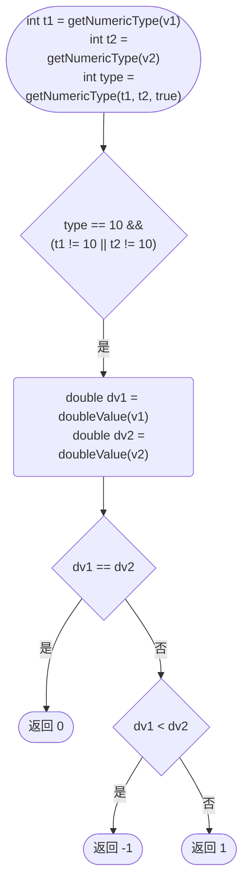
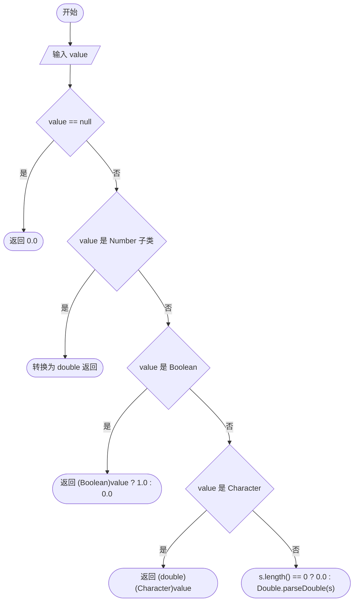

在使用`Mybatis`进行字符比较时遇到了`java.lang.NumberFormatException`异常。

`Mybatis`版本为`3.5.14`。

<!-- more -->

## 问题复现

### 准备数据

`mapper`文件部分定义如下，`level`为字符串参数，值为`"a"`。

```xml
<select id="find" resultType="tk.lsq27.imports.User">
    select id, str, num1, num2 from excel
    <where>
        <if test="level == 'a'">
            num1 >= 10
        </if>
    </where>
</select>
```

### 错误堆栈

从错误堆栈里可以看到`Mybatis`的`Mapper`执行流程，在其他文章会进行分析。

可以看到，问题出现在 `Ognl` 相关类中，在转换`String`为`Double`时报了`NumberFormatException`异常。

```log
Caused by: java.lang.NumberFormatException: For input string: "a"
	at sun.misc.FloatingDecimal.readJavaFormatString(FloatingDecimal.java:2043) ~[na:1.8.0_382]
	at sun.misc.FloatingDecimal.parseDouble(FloatingDecimal.java:110) ~[na:1.8.0_382]
	at java.lang.Double.parseDouble(Double.java:538) ~[na:1.8.0_382]
	at org.apache.ibatis.ognl.OgnlOps.doubleValue(OgnlOps.java:253) ~[mybatis-3.5.14.jar:3.5.14]
	at org.apache.ibatis.ognl.OgnlOps.compareWithConversion(OgnlOps.java:104) ~[mybatis-3.5.14.jar:3.5.14]
	at org.apache.ibatis.ognl.OgnlOps.isEqual(OgnlOps.java:153) ~[mybatis-3.5.14.jar:3.5.14]
	at org.apache.ibatis.ognl.OgnlOps.equal(OgnlOps.java:814) ~[mybatis-3.5.14.jar:3.5.14]
	at org.apache.ibatis.ognl.ASTEq.getValueBody(ASTEq.java:52) ~[mybatis-3.5.14.jar:3.5.14]
	at org.apache.ibatis.ognl.SimpleNode.evaluateGetValueBody(SimpleNode.java:212) ~[mybatis-3.5.14.jar:3.5.14]
	at org.apache.ibatis.ognl.SimpleNode.getValue(SimpleNode.java:258) ~[mybatis-3.5.14.jar:3.5.14]
	at org.apache.ibatis.ognl.Ognl.getValue(Ognl.java:586) ~[mybatis-3.5.14.jar:3.5.14]
	at org.apache.ibatis.ognl.Ognl.getValue(Ognl.java:550) ~[mybatis-3.5.14.jar:3.5.14]
	at org.apache.ibatis.scripting.xmltags.OgnlCache.getValue(OgnlCache.java:46) ~[mybatis-3.5.14.jar:3.5.14]
	at org.apache.ibatis.scripting.xmltags.ExpressionEvaluator.evaluateBoolean(ExpressionEvaluator.java:32) ~[mybatis-3.5.14.jar:3.5.14]
	at org.apache.ibatis.scripting.xmltags.IfSqlNode.apply(IfSqlNode.java:34) ~[mybatis-3.5.14.jar:3.5.14]
	at org.apache.ibatis.scripting.xmltags.MixedSqlNode.lambda$apply$0(MixedSqlNode.java:32) ~[mybatis-3.5.14.jar:3.5.14]
	at java.util.ArrayList.forEach(ArrayList.java:1259) ~[na:1.8.0_382]
	at org.apache.ibatis.scripting.xmltags.MixedSqlNode.apply(MixedSqlNode.java:32) ~[mybatis-3.5.14.jar:3.5.14]
	at org.apache.ibatis.scripting.xmltags.TrimSqlNode.apply(TrimSqlNode.java:58) ~[mybatis-3.5.14.jar:3.5.14]
	at org.apache.ibatis.scripting.xmltags.MixedSqlNode.lambda$apply$0(MixedSqlNode.java:32) ~[mybatis-3.5.14.jar:3.5.14]
	at java.util.ArrayList.forEach(ArrayList.java:1259) ~[na:1.8.0_382]
	at org.apache.ibatis.scripting.xmltags.MixedSqlNode.apply(MixedSqlNode.java:32) ~[mybatis-3.5.14.jar:3.5.14]
	at org.apache.ibatis.scripting.xmltags.DynamicSqlSource.getBoundSql(DynamicSqlSource.java:39) ~[mybatis-3.5.14.jar:3.5.14]
	at org.apache.ibatis.mapping.MappedStatement.getBoundSql(MappedStatement.java:320) ~[mybatis-3.5.14.jar:3.5.14]
	at org.apache.ibatis.executor.CachingExecutor.query(CachingExecutor.java:88) ~[mybatis-3.5.14.jar:3.5.14]
	at org.apache.ibatis.session.defaults.DefaultSqlSession.selectList(DefaultSqlSession.java:154) ~[mybatis-3.5.14.jar:3.5.14]
	at org.apache.ibatis.session.defaults.DefaultSqlSession.selectList(DefaultSqlSession.java:147) ~[mybatis-3.5.14.jar:3.5.14]
	at org.apache.ibatis.session.defaults.DefaultSqlSession.selectList(DefaultSqlSession.java:142) ~[mybatis-3.5.14.jar:3.5.14]
	at sun.reflect.NativeMethodAccessorImpl.invoke0(Native Method) ~[na:1.8.0_382]
	at sun.reflect.NativeMethodAccessorImpl.invoke(NativeMethodAccessorImpl.java:62) ~[na:1.8.0_382]
	at sun.reflect.DelegatingMethodAccessorImpl.invoke(DelegatingMethodAccessorImpl.java:43) ~[na:1.8.0_382]
	at java.lang.reflect.Method.invoke(Method.java:498) ~[na:1.8.0_382]
	at org.mybatis.spring.SqlSessionTemplate$SqlSessionInterceptor.invoke(SqlSessionTemplate.java:425) ~[mybatis-spring-2.1.2.jar:2.1.2]
	at org.mybatis.spring.SqlSessionTemplate.selectList(SqlSessionTemplate.java:224) ~[mybatis-spring-2.1.2.jar:2.1.2]
	at org.apache.ibatis.binding.MapperMethod.executeForMany(MapperMethod.java:147) ~[mybatis-3.5.14.jar:3.5.14]
	at org.apache.ibatis.binding.MapperMethod.execute(MapperMethod.java:80) ~[mybatis-3.5.14.jar:3.5.14]
	at org.apache.ibatis.binding.MapperProxy$PlainMethodInvoker.invoke(MapperProxy.java:141) ~[mybatis-3.5.14.jar:3.5.14]
	at org.apache.ibatis.binding.MapperProxy.invoke(MapperProxy.java:86) ~[mybatis-3.5.14.jar:3.5.14]
	at com.sun.proxy.$Proxy48.find(Unknown Source) ~[na:na]
```

## 原因分析

`Ognl`在解析`"a" == 'a'`时，在参与比较的两值至少有一个为数字时，会将两值都转换为`Double`进行比较。相关代码位于`OgnlOps.compareWithConversion`，函数流程如下图所示



其中`OgnlOps.getNumericType`流程如下

```java
public static int getNumericType(Object value) {
    if (value != null) {
        Class c = value.getClass();
        if (c == Integer.class) {
            return 4;
        }
        if (c == Double.class) {
            return 8;
        }
        if (c == Boolean.class) {
            return 0;
        }
        if (c == Byte.class) {
            return 1;
        }
        if (c == Character.class) {
            return 2;
        }
        if (c == Short.class) {
            return 3;
        }
        if (c == Long.class) {
            return 5;
        }
        if (c == Float.class) {
            return 7;
        }
        if (c == BigInteger.class) {
            return 6;
        }
        if (c == BigDecimal.class) {
            return 9;
        }
    }
    return 10;
}
```

其中`OgnlOps.doubleValue`流程如下



两个参数均为非数字类型，此时调用`Object.equals`或`Comparable.compareTo`（两个参数需类型相同并实现`Comparable`接口）比较是否相等

## 解决方案

固定第一个值为字符串，变化第二个值可以得到如下表格

| Ognl | Java | 参与比较时的值 | 比较方法               | 备注                                  |
| ---- | ---- | -------------- | ---------------------- | ------------------------------------- |
| ''   | ""   | ""             | `Comparable.compareTo` |                                       |
| ""   | ""   | ""             | `Comparable.compareTo` |                                       |
| "1"  | "1"  | "1"            | `Comparable.compareTo` |                                       |
| '12' | "12" | "12"           | `Comparable.compareTo` |                                       |
| '1'  | '1'  | 49.0           | ==                     | 此时两个值强转为 double，可能会抛异常 |
| 1    | 1    | 1              | ==                     | 此时两个值强转为 double，可能会抛异常 |

结合上面的源码解析，有如下结论

- 两个参数有至少有一个为数字类型时，就会强转为`double`进行比较
- `''`是空字符串
- 'x'是字符，是数字的一种

解决方式显而易见，总是使用`"`包裹字符，让`Ognl`将其处理为字符串。

```
test = 'level == "a"'
```

## TODO

找到`Ognl`这样设计的原因。
