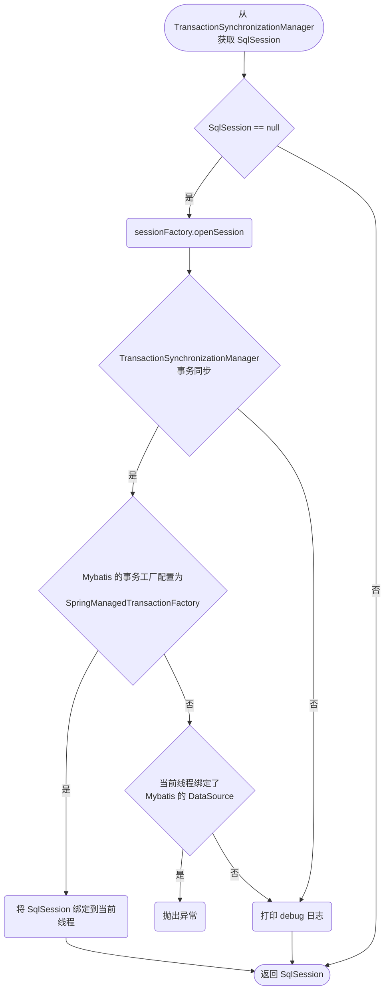

作为`Java`最流行的框架`Spring`，`Mybatis`也为其提供了支持。

由于`SqlSession`不是线程安全的，所以没有办法将其作为单例注册到`Spring`容器。即使作为多例注册到`Spring`，也无法享受到`Spring`方便的声明式事务管理。

所以官方引入了新的`SqlSessionTemplate`。它是线程安全、`Spring`管理的`SqlSession`，与`Spring`事务管理配合使用，以确保实际使用的`SqlSession`是与当前`Spring`事务关联的`SqlSession`。此外，它还管理会话生命周期，包括根据`Spring`事务配置根据需要关闭、提交或回滚会话。

<!-- more -->

`SqlSessionTemplate`从`Spring`中获取用以执行`SQL`的`SqlSession`的流程如下图所示

## 参考

- [mybatis – MyBatis 3 | Java API](https://mybatis.org/mybatis-3/zh_CN/java-api.html)
