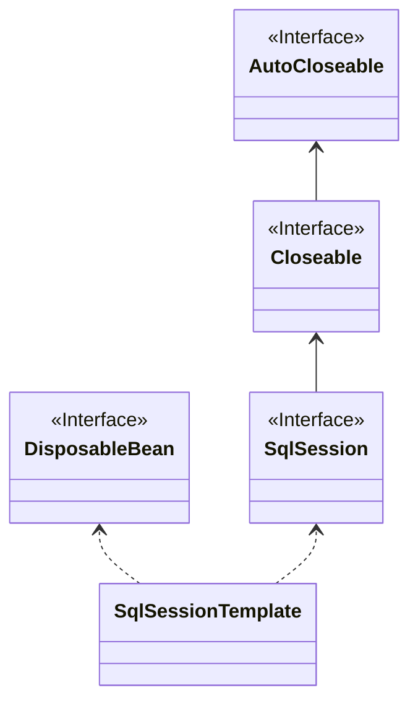

作为`Java`最流行的框架`Spring`，`Mybatis`也为其提供了支持。

由于`SqlSession`不是线程安全的，所以没有办法将其作为单例注册到`Spring`容器。即使作为多例注册到`Spring`，也无法享受到`Spring`方便的声明式事务管理。

所以官方引入了新的`SqlSessionTemplate`。它是线程安全、`Spring`管理的`SqlSession`，与`Spring`事务管理配合使用，以确保实际使用的`SqlSession`是与当前`Spring`事务关联的`SqlSession`。此外，它还管理会话生命周期，包括根据`Spring`事务配置根据需要关闭、提交或回滚会话。

<!-- more -->

##

该模板需要 SqlSessionFactory 来创建 SqlSessions，并作为构造函数参数传递。它也可以构造为指示要使用的执行器类型，否则，将使用会话工厂中定义的默认执行器类型。
该模板将 MyBatis PersistenceExceptions 转换为未经检查的 DataAccessExceptions，默认使用 MyBatisExceptionTranslator。
由于`SqlSessionTemplate`是线程安全的，因此所有 DAO 都可以共享单个实例;这样做也应该可以节省少量内存。



`SqlSessionTemplate`从`Spring`中获取用以执行`SQL`的`SqlSession`的流程如下图所示


```java
classDiagram
direction BT
class DaoSupport
class FactoryBean~T~ {
<<Interface>>
}
class InitializingBean {
<<Interface>>
}
class MapperFactoryBean~T~
class SqlSessionDaoSupport

DaoSupport  ..>  InitializingBean
MapperFactoryBean~T~  ..>  FactoryBean~T~
MapperFactoryBean~T~  -->  SqlSessionDaoSupport
SqlSessionDaoSupport  -->  DaoSupport
```

## 参考

- [mybatis – MyBatis 3 | Java API](https://mybatis.org/mybatis-3/zh_CN/java-api.html)
